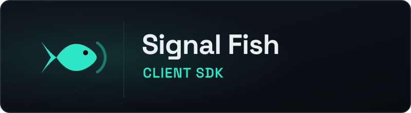

  

C# multiplayer signaling for Unity and .NET

# Signal Fish Client (.NET)

A C# client SDK for the [Signal Fish](https://github.com/Ambiguous-Interactive/signal-fish-server)
multiplayer signaling service — connect a game over WebSocket, place players
in rooms, relay game data, and react to everything the server does as typed
events. The library targets `netstandard2.1`, carries zero NuGet
dependencies, and ships as a Unity package (see [Unity](unity.md)).

[Get started](getting-started.md){ .md-button .md-button--primary .sf-home-action }
[View on GitHub](https://github.com/Ambiguous-Interactive/signal-fish-client-dotnet){ .md-button .sf-home-action }

## Features

- **Rooms and lobbies** — join-or-create with shareable room codes, player
  rosters, readiness with an `all_ready` signal, and server-gated game start
- **Relay** — JSON game data fanout with sender identity; v3 adds the
  delivery classes (reliable, latest-wins, volatile) plus a raw binary
  game-data lane (a MessagePack envelope over WebSocket binary frames)
- **Heartbeats and liveness** — a deterministic ping cadence with a
  silence-timeout that declares death instead of hanging
- **Reconnection** — a manual persisted-seat procedure, an opt-in automatic
  policy with deterministic backoff, or both
- **Spectators** — read-only joins with leave confirmation and rosters
- **Authority** — claim, transfer, and authority-gated `StartGame`
- **WebRTC signaling (v3)** — session plans, peer directives, and verbatim
  signal relay for mesh topologies

## Two clients

- `SignalFishClient` (`SignalFish.Client.Async`) — a thread-safe client over
  a background driver loop that multiplexes sends, receives, and heartbeat
  timing; callers queue commands and await events from any thread. See
  [Client API](client-api.md).
- `SignalFishPollingClient` (`SignalFish.Client.Polling`) — a deliberately
  single-threaded, caller-driven client for `Update()`-style game loops: one
  `Poll()` per frame, then drain the events. See
  [Polling client](polling-client.md).

Both clients run over any `ITransport` (see [Transport](transport.md)) and
take the clock as an injectable `ISignalFishClock`, which is what makes
them testable without wall-clock luck (see [Testing](testing.md)).

## Quick links

| Page | What it covers |
| --- | --- |
| [Installation & Quick Start](getting-started.md) | Install, connect, authenticate, join, relay |
| [Examples](examples.md) | Lobby flow, authority relay, reconnection, game loop |
| [Client API](client-api.md) | Commands, options, and session state |
| [Polling client](polling-client.md) | Frame-driven usage for game loops |
| [Transport](transport.md) | The `ITransport` contract and `WebSocketTransport` |
| [Unity](unity.md) | The Unity package, WebGL transport, driver sample |
| [Protocol versioning](protocol-versioning.md) | The v2 relay floor and v3 negotiation |
| [Delivery](delivery.md) | Delivery classes, backpressure, queue sizing |

## Project links

- Server repository: <https://github.com/Ambiguous-Interactive/signal-fish-server>
- Rust client (API parity source): <https://github.com/Ambiguous-Interactive/signal-fish-client-rust>
- Repository and issue tracker: <https://github.com/Ambiguous-Interactive/signal-fish-client-dotnet>
- Releasing the SDK: the [operator runbook](releasing.md)

> **AI disclosure:** This project was developed with substantial assistance
> from AI coding agents (Codex, Gemini, GLM, and others). Humans created the
> protocol concepts and core design and retained oversight of architecture
> and code review.
